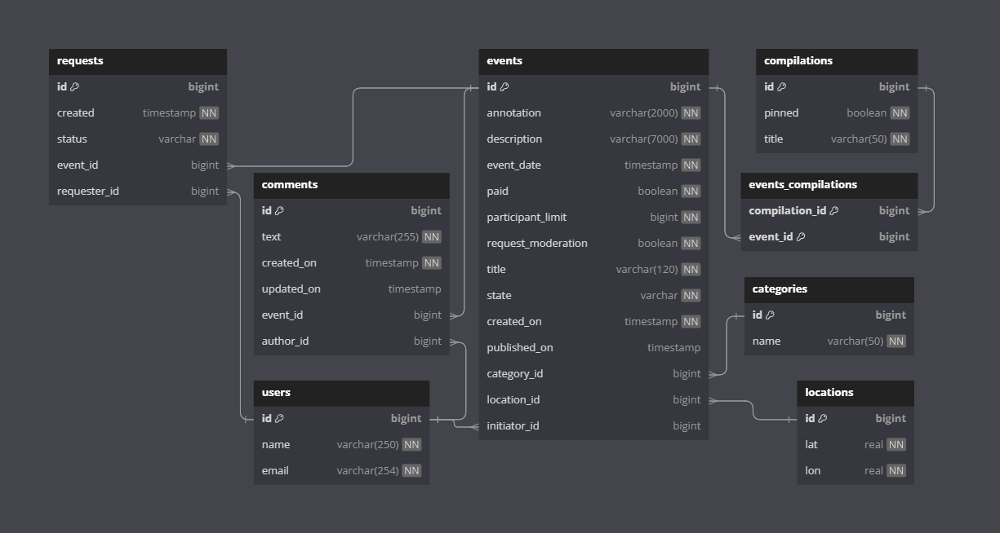
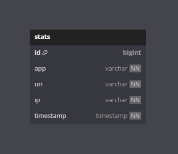

# Explore With Me
Свободное время — ценный ресурс. Ежедневно мы планируем, как его потратить — куда и с кем сходить.
Сложнее всего в таком планировании поиск информации и переговоры. Нужно учесть много деталей:
какие намечаются мероприятия, свободны ли в этот момент друзья, как всех пригласить и где собраться.

**Explore With Me** - афиша. В этой афише можно предложить какое-либо событие от выставки
до похода в кино и собрать компанию для участия в нём.

---

**Технологии:** Java + Spring Boot + Maven + Hibernate + MapStruct + Lombok + PostgreSQL + Docker

---

## Микросервисная архитектура
Приложение состоит из 2 сервисов:
- **ewm** - базовый сервис - содержит весь основной функционал приложения.
####
- **stats** - сервис статистики - собирает, хранит и отдает по запросу статистику по просмотрам.

---

#### Базовый сервис
API сервиса разделено на три части:
- публичная доступна без регистрации любому пользователю сети;
- закрытая доступна только авторизованным пользователям;
- административная — для администраторов сервиса.

####

#### Сервис статистики
Собирает информацию о количестве обращений пользователей к спискам событий, а также о количестве запросов
к подробной информации о событии.

####

Базовый сервис и сервис статистики сохраняют и загружают данные из разных баз данных.
Взаимодействие сервисов в момент сохранения информации о запросе к API осуществляется с помощью клиента сервиса статистики

---

## Схемы баз данных
- БД базового сервиса


- БД сервиса статистики



---

## Установка и запуск проекта
Необходимо настроенная система виртуализации, установленный Docker Desktop(скачать и установить можно
с официального сайта https://www.docker.com/products/docker-desktop/)

1. Клонируйте репозиторий проекта на свою локальную машину:
   ```
   git clone git@github.com:kaldubasina/java-explore-with-me.git
   ```
2. Запустите коммандную строку и перейдите в коррень директории с проектом.
####
3. Соберите проект
   ```
   mvn clean install
   ```
4. Введите следующую команду, которая подготовит и запустит приложение на вашей локальной машине
   ```
   $  docker-compose up
   ```
5. Приложение будет запущено на порту 8080. Вы можете открыть свой веб-браузер и перейти
   по адресу `http://localhost:8080`, чтобы получить доступ к приложению Explore With Me.

---